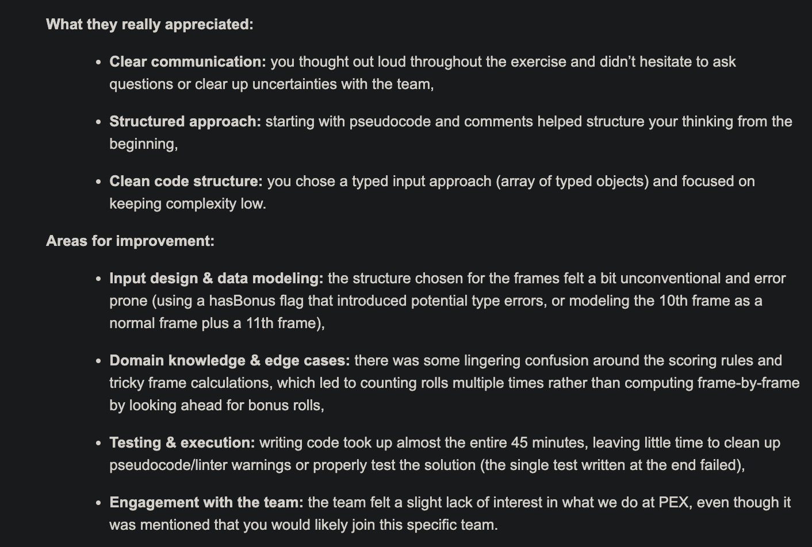

# Bowling score calculator

## Context
During a technical interview (live coding assessment) 
I was tasked to come up with a solution to calculate the score of a party of bowling of 1 player.
The assumption that the client passed valid values, 
that everything that enters the scoring function has already been validated (no need for Zod, Joi etc...).

The only thing given in advance was a link to a description of the rules to properly calculate a party score.
Here is a short summary:
- A party is composed of 10 rounds.
- Global scoring range from 0 to 300.
- A player has 2 throws per round to knock the 10 keels.
- If the 10 keels are knocked down on the first throw: it's a strike.
- If the 10 keels are knocked down on the second throw: it's a spare.

Bonus:
- strike: add the result of the next 2 throws to the striking round.
- spare: add the result of the next throw to the sparing round.
- If user score a strike at the last round, It's given 2 more throws.
- If user score a spare at the last round, It's given 1 more throw.

Nothing more was given.

## Version 1 (result of the live coding)

The first commit of this repository is what I have achieved at the end of the hour.
I ended up with a faulty result of 320 (so 20 out of the max scoring range...)
Which I fixed after hours.
The issue was due to the way I handled the last round bonus in a strike/spare event.
I was effectively adding the result at the last round but also adding them on top, so counting them twice.

Here are the feedback I was given afterward:



In case the screenshot is not working:
```
What they really appreciated:

Clear communication: you thought out loud throughout the exercise and didn’t hesitate to ask questions or clear up uncertainties with the team,

Structured approach: starting with pseudocode and comments helped structure your thinking from the beginning,

Clean code structure: you chose a typed input approach (array of typed objects) and focused on keeping complexity low.

Areas for improvement:

Input design & data modeling: the structure chosen for the frames felt a bit unconventional and error prone (using a hasBonus flag that introduced potential type errors, or modeling the 10th frame as a normal frame plus a 11th frame),

Domain knowledge & edge cases: there was some lingering confusion around the scoring rules and tricky frame calculations, which led to counting rolls multiple times rather than computing frame-by-frame by looking ahead for bonus rolls,

Testing & execution: writing code took up almost the entire 45 minutes, leaving little time to clean up pseudocode/linter warnings or properly test the solution (the single test written at the end failed),

Engagement with the team: the team felt a slight lack of interest in what we do at PEX, even though it was mentioned that you would likely join this specific team.
```

After the exercise I was asked, if given more time (all the time in the world) what would I have changed and/or do.
To which I responded:
- Testing scenarios: nominal one (no bonuses), max scoring test (all striking rounds), spare result calculation, lowest score (0 every throw)
- Reflect on the input format, check if a better format would work better.
- Split the function with utilities function (which I did while debugging the last frame issue)

My main issue during this test was my mindset regarding the issue: I was stuck trying to calculate step-by-step as if I didn't already have the next result ready.
Basically my mind was in "we should calculate the scoring live", meaning that I wanted to keep track of bonuses given per each round to then calculate them on the next round.
Once the interviewer pointed out that I already had everything at hands, I could just directly check what was the result of the "future" 
ie: on round 1 we can already check round2 and round 3, if we were in a bonus situation.
This heads up cleared all difficulties and complexity and led me to finishing up the exercise (minus the last round bonus situation...)

In a version 2 of this exercise I will improve the current solution to make it more elegant (input format wise, testing scenarios, code improvements)

I plan in a future version, to code the live calculation which I think will be "more difficult" due to the active bonus calculation.


## V2

In this version, I took into account my feeling regarding the input format (which is really the whole point of this test IMO).
The bonus could be calculated instead of relying on it from the client. I also properly split the code, and handle more gracefully the extra frame.

While doing this, i thought of another more rough solution, it will be the version 3.
